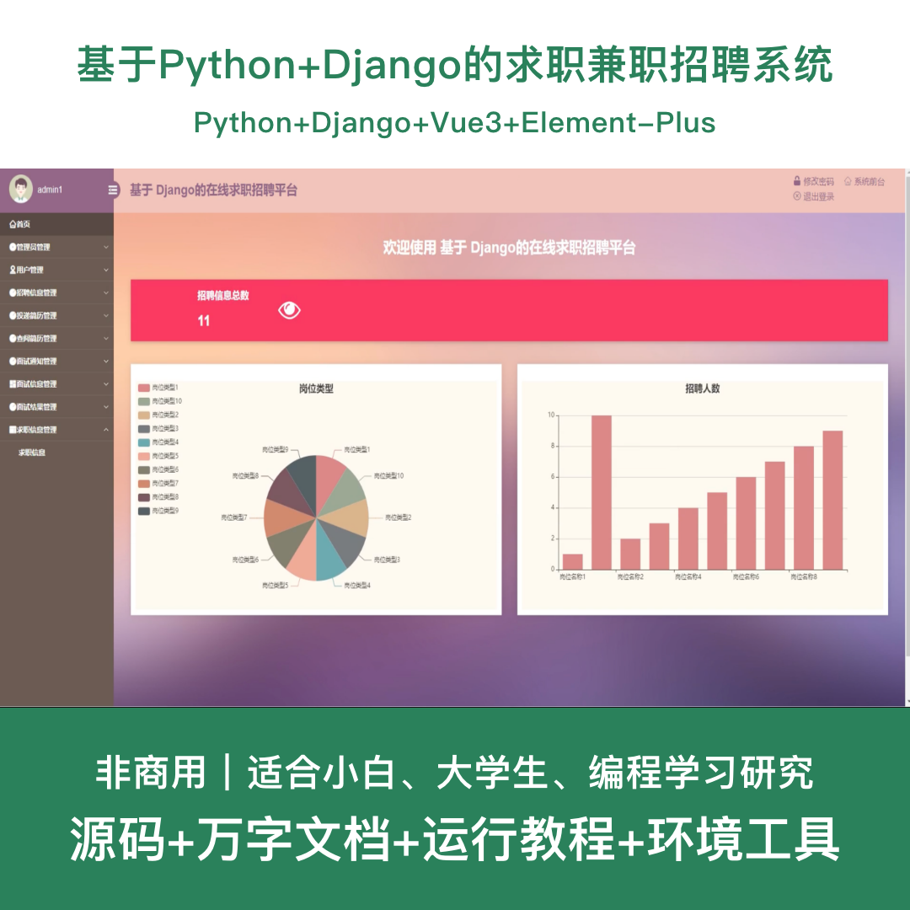
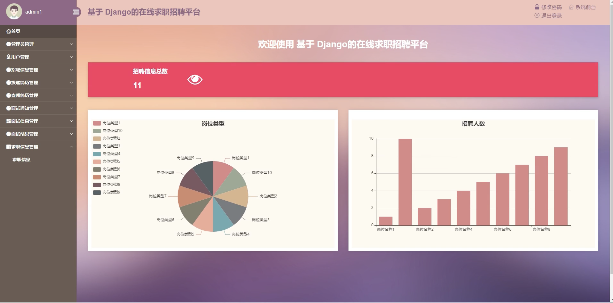
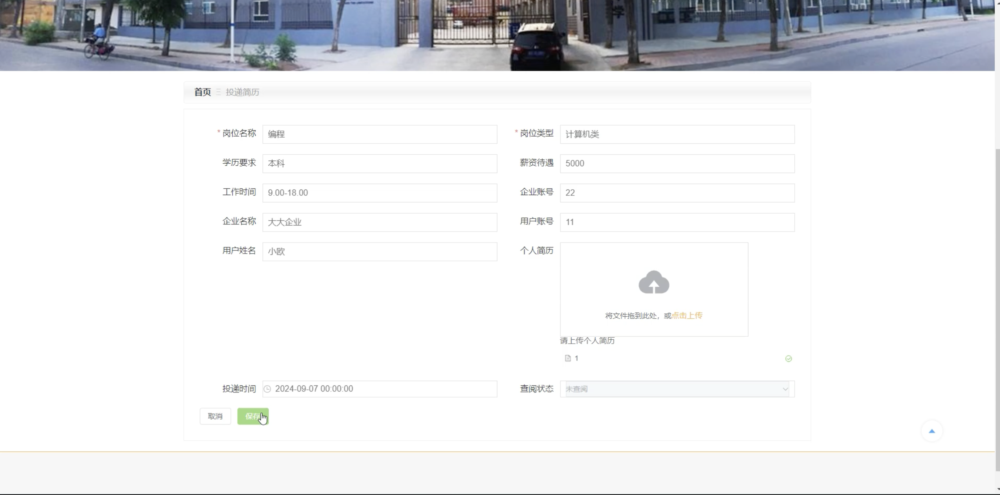
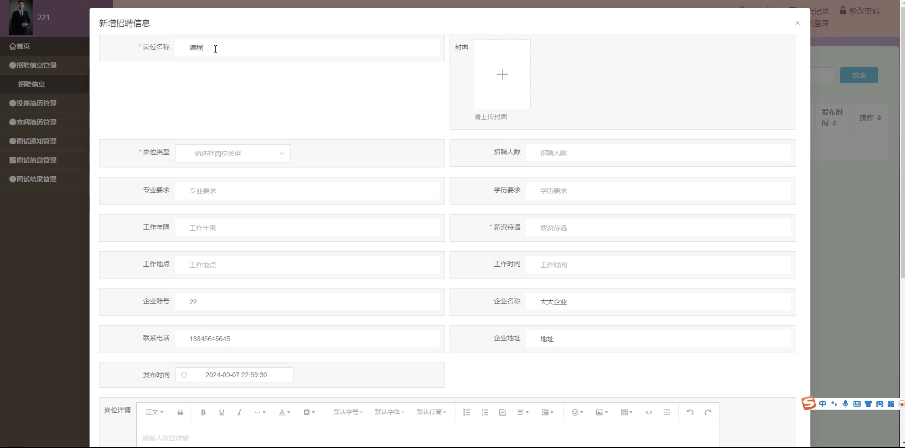
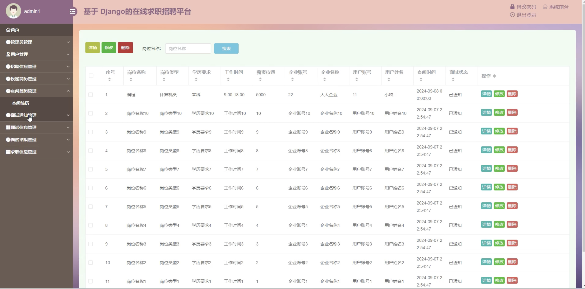
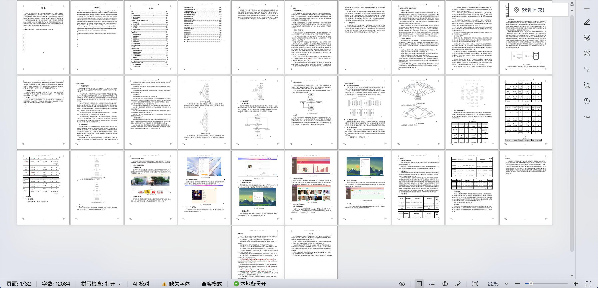

# python128D
python128D基于Python+Django的求职兼职招聘系统+LW
 
## 源码问题查看主页咨询

### 一、关键词
求职招聘系统、兼职平台、招聘管理系统、求职系统、兼职招聘平台

### 二、作品包含
源码+数据库+万字设计文档+全套环境和工具资源+本地部署教程

### 三、项目技术
前端技术： Html、Css、Js、Vue3.2、Element-Plus
后端技术：Python3.7+、Django2.0、PyMySQL

### 四、运行环境（以下版本亲测，其他版本兼容性请自行测试）
开发工具：PyCharm + VSCODE

数据库：MySQL 5.7+

数据库管理工具：Navicat10以上版本

环境配置软件：Python 3.7+

前端Nodejs：16+

浏览器：谷歌浏览器

### 五、项目介绍
项目编号：python128D

基于Python+Django的求职兼职招聘系统，为求职者和企业提供便捷的招聘求职平台，支持岗位发布、简历投递、面试管理等功能，提升招聘效率。

角色：管理员、用户、企业

用户功能：注册登录、浏览招聘信息、投递简历、查看面试通知、个人简历管理、求职信息发布、在线聊天。

企业功能：注册登录、发布招聘信息、查看投递简历、发送面试通知、面试结果管理、在线聊天。

管理员功能：用户管理、企业管理、岗位类型管理、招聘信息管理、求职信息管理、简历管理、面试管理、轮播图管理、公告管理。

数据库表：17张

### 六、运行截图

